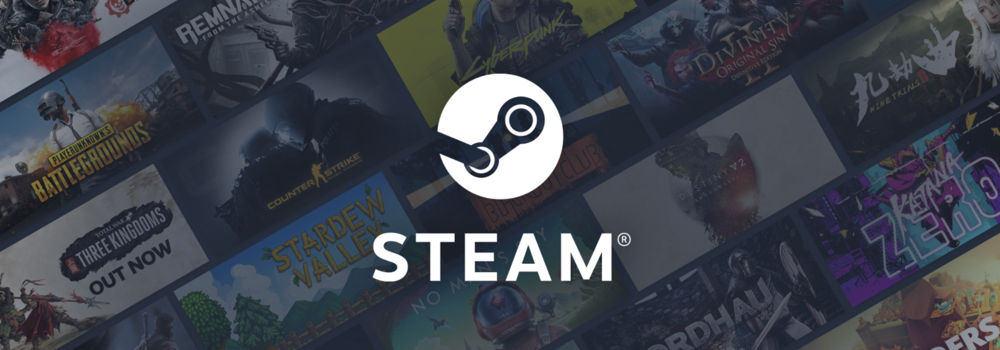

# STEAM Game Market Analysis

The STEAM Game Market Analysis Project used a large amount of user data and review data provided by STEAM to analyze the game market and establish new standards.  Through this project, our aim was to analyze the game market by supplementing (1) the absence of existing research and (2) the recommendation system which considered only the users' playtime. We were able to develop a personalized recommendation system by clusters which were formed based on the users' evaluation of each game they played.

## Team

| Name   | Github                         |
| ------ | ------------------------------ |
| 강세정 | https://github.com/SEJEONGKANG |
| 김소정 | https://github.com/ssokeem     |
| 김은서 | https://github.com/eunsuh-kim  |
| 박유찬 | https://github.com/chanchanuu  |
| 장동현 | https://github.com/rroyc20     |

## Procedure

#### (1) Data Collection

- Collected game data using STEAM API
- Game data included game-related user data

#### (2) Data Preprocessing

- Preprocessed text for review data
- Performed emotional analysis modeling for 8 aspect influencing review writing through **[Aspect-Based Sentiment Analysis](https://huggingface.co/yangheng/deberta-v3-base-absa-v1.1)**  
  _(Gameplay, Market, Social, Narrative, Graphics, Technical, Value, Audio)_
- Created a user review chain for each user, taking into account the user's cumulative playtime for each game played

#### (3) Modeling

- Performed cluster modeling through **k-means** to provide new criteria using datasets built through emotional analysis
- 8 clusters formed as a result  
  _(insignificant 1, technical deficiency, popular octagon, social interaction, insignificant 2, not bad, immersive audio, slight technical deficiency)_
- Used **[SASRec](https://github.com/kang205/SASRec)** for users' next game recommendations

#### (4) Visualization

- Created a dashboard for the game market using Tableau
- [**View Dashboard 🎮**](https://public.tableau.com/app/profile/eunsuh.kim/viz/SteamGameMarketAnalysis/SteamDashboard0)

## Data

| Column                         | Description                      |
| ------------------------------ | -------------------------------- |
| recommendationid               | 추천 아이디                      |
| language                       | 작성 언어                        |
| review                         | 게임에 대한 리뷰                 |
| timestamp_created              | 최초 작성 타임스탬프             |
| timestamp_updated              | 최종 수정 타임스탬프             |
| voted_up                       | 리뷰의 긍정/부정 유무            |
| votes_up                       | 추천 수                          |
| author_steamid                 | 작성자 스팀 아이디               |
| author_num_games_owned         | 작성자 보유 게임 개수            |
| author_num_reviews             | 작성자가 작성한 리뷰 수          |
| author_playtime_forever        | 작성자 플레이 타임               |
| author_playtime_last_two_weeks | 작성자 최근 2주 동안 플레이 타임 |
